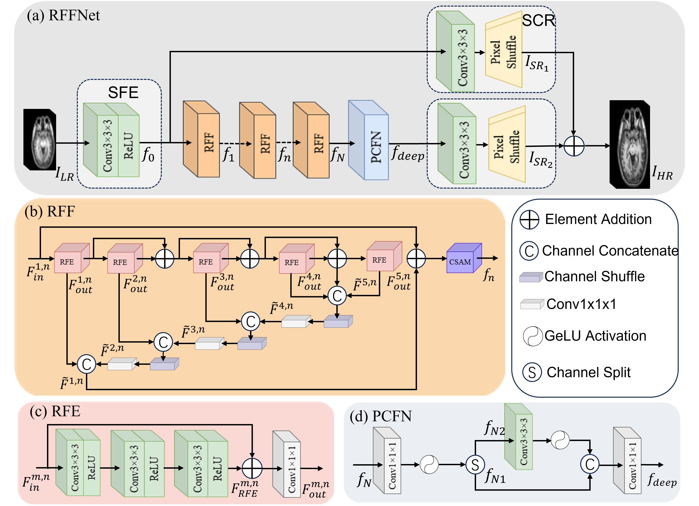

# RFFNet: A Lightweight Reverse Feature Fusion Network for 3D Brain MRI Super-Resolution

This repository provides the official PyTorch implementation of **RFFNet**, proposed in the paper:

> **RFFNet: A Lightweight Reverse Feature Fusion Network for 3D Brain MRI Super-Resolution Reconstruction**  


---

## 📌 Introduction

3D Magnetic Resonance Imaging (3D MRI) is a native volumetric imaging modality widely used in clinical diagnosis. However, acquiring high-resolution (HR) MRI volumes is time-consuming and constrained by hardware limitations.

We propose **RFFNet**, a lightweight convolutional neural network for **3D MRI super-resolution (SR)**.  
The core contribution lies in a **Reverse Feature Fusion (RFF)** mechanism, which propagates deep hierarchical features backward to shallow layers via **parameter-free channel shuffling**, enabling efficient multi-scale information fusion.

**Key features of RFFNet:**
- Reverse feature propagation with channel shuffle (parameter-free)
- Parallel channel–spatial attention mechanism (CSAM)
- 3D partial convolution-based feed-forward network (PCFN)
- Artifact-free upsampling via 3D PixelShuffle
- Lightweight design with strong performance–efficiency trade-off

RFFNet achieves **state-of-the-art PSNR/SSIM performance** on multiple public 3D brain MRI datasets while using significantly fewer parameters than Transformer-based models.

---

## 🧠 Network Architecture

<p align="center">
  
</p>

The overall architecture consists of:
1. Shallow Feature Extraction (SFE)
2. Cascaded Reverse Feature Fusion (RFF) modules
3. Partial Convolution-based Feed-Forward Network (PCFN)
4. Sub-pixel Convolution Reconstruction (SCR)

---

## 📂 Datasets

We evaluate RFFNet on the following public 3D brain MRI datasets:

- **Kirby21** ([NITRC](https://www.nitrc.org/projects/kirby21/))
- **BraTS2019** ([CBICA](https://www.med.upenn.edu/cbica/brats2019.html))
- **IXI** ([Official Website](https://brain-development.org/ixi-dataset/))

All datasets are preprocessed following the protocol described in the paper:
- Gaussian blurring + bicubic downsampling
- Patch-based training (e.g., 32×32×32)
- Intensity normalization to [0, 1]

⚠️ Due to license restrictions, datasets are **not included** in this repository.

---

## ⚙️ Requirements

Python >= 3.9  
PyTorch >= 2.0  
numpy  
scipy  
scikit-image  
nibabel  
tqdm

---

## 🚀 Training

RFFNet is trained in a supervised manner using paired low-resolution (LR) and high-resolution (HR) 3D MRI volumes.

Example: Training for 2× Super-Resolution

```bash
python train.py \
  --upscale_factor 2 \
  --dataset Kirby21 \
  --batch_size 32 \
  --epochs 200 \
  --log_dir logs
```

Training Settings:
Optimizer: Adam (β1 = 0.9, β2 = 0.999),
Loss function: Mean Squared Error (MSE),
Learning rate: 1e-4, halved every 50 epochs,
Patch size: 32 × 32 × 32,
Framework: PyTorch,
Training logs and model checkpoints are saved automatically during training.

---

## 🧪 Testing

To evaluate a trained RFFNet model, run:

```bash
python model_test.py \
  --hr_path dataset/Kirby21/test/hr \
  --pre_save_path results/Kirby21/x2 \
  --pth_path logs/XXXX_XX_XX_XX_XX_XX/XX_best_psnr.pth \
  --upscale_factor 2


